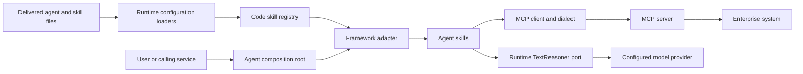

# AI Agent Lab — System Specification

This document is the system-level specification for the Python applications in
this repository. It describes the current system boundary, component ownership,
runtime flow, configuration contracts, and security behavior. Framework- and
agent-specific detail remains in the linked design documents.

## Purpose and scope

AI Agent Lab develops and compares enterprise agents while keeping their
functional capabilities, security decisions, scenarios, and MCP contracts
independent of the agent framework. The Mail agent uses Microsoft Agent
Framework; the Wiki agent uses LangChain/LangGraph. A new framework integration
is an adapter and composition change, not a second implementation of the
agent's business behavior.

This repository contains the Mail and Wiki applications, their MCP clients and
server distributions, delivered configuration, datasets, and tests. It does not
own the shared technical agent runtime. Common configuration loading, manifest
schemas, runtime contracts, security primitives, user-context construction,
common errors, and the framework-neutral reasoning port are provided by
[`ai-enterprise-agent-runtime`](https://github.com/ygo74/ai-enterprise-agent-runtime).
The runtime's system-level specification is its
[`spec/README.md`](https://github.com/ygo74/ai-enterprise-agent-runtime/blob/main/spec/README.md).

## System context and flow

The application composition root loads delivered configuration, constructs the
runtime user context from the authenticated principal and application-supplied
permissions, binds manifests to implemented skills, and builds an agent using
the selected framework's public API. The framework adapter translates calls to
and from skill descriptors; it does not own domain rules. Skills orchestrate
deterministic business logic and MCP tool contracts. MCP clients translate
between those contracts and the selected server's dialect.

Agents do not integrate with enterprise systems directly. A system is reached
through an MCP server, whether that server is maintained here or supplied by a
third party. The agent-side dialect is the compatibility boundary.

## Components and ownership

| Component | Responsibility | Owner |
|---|---|---|
| `ai_agent_lab.mail`, `ai_agent_lab.wiki` | Agent-specific models, skills, permissions, tool ports, and composition | This repository |
| `ai_agent_lab.maf`, `ai_agent_lab.langgraph` | Framework adapters and framework-specific orchestration | This repository |
| `ai_agent_lab.core` | Shared chat-provider choices and Azure credential provider only | This repository |
| `mail_mcp.*`, `wiki_mcp.*` | MCP wire contracts, server implementations, and dialect-specific integration | This repository |
| Runtime configuration, contracts, errors, reasoning, identity, and security APIs | Reusable technical foundations | `ai-enterprise-agent-runtime` |
| Prompts and agent/skill YAML, Markdown, and MCP bindings | Deployment-delivered behavior and integration selection | `config/` in this repository |

The application owns which permissions a principal receives. The runtime's
`UserContextFactory` copies that identity and those permissions into an immutable
context; it does not infer a role policy. `azure_credentials.py` and `chat.py`
remain in core because they describe the current agents' model configuration.

## Configuration contracts

Python agents use `YGO74_AGENT_RUNTIME_CONFIG_DIR` to select the configuration
directory. If it is unset, the runtime's configuration discovery rules apply.
Mail and Wiki declare the runtime `configuration` extra, which provides
configuration discovery, `.env` loading, safe YAML parsing, and manifest
validation without requiring the runtime HTTP extra.

The YAML structures are fixed versioned contracts. Draft 2020-12 schemas are
published as runtime package resources:

- `agent.yaml`: `urn:ygo74:agent-runtime:agent-manifest:1`
- `skill.yaml`: `urn:ygo74:agent-runtime:skill-manifest:1`

The schemas reject unknown fields and validate structural values and enums.
`AGENT.md` and `SKILL.md` are separate Markdown inputs and are not covered by
those schemas. The application still resolves permissions against its registry
and the runtime still enforces the configured security floor; a valid schema
does not grant permission to perform an operation.

Changes to the accepted YAML structure are versioned public-contract changes.
The typed input models, packaged schemas, schema identifiers, and documentation
must be updated together.

## Security behavior

- Credentials remain in infrastructure and credential providers. They are not
  stored in `UserContext`, included in prompts, or logged.
- A `UserContext` identifies the caller and carries application-supplied
  permissions; it is not an authentication credential or a source of policy.
- All free text returned by an MCP tool is untrusted. Reasoning prompts fence it
  as data, separate from trusted instructions.
- A model can propose a write but cannot authorize it. Deterministic operation
  classification, permission checks, and confirmation gates control writes.
- Confirmation requests are scoped to the user, consumed once, and audited with
  identifiers rather than message or document contents.
- MCP servers remain separate from agent domain packages and do not import
  `ai_agent_lab`.

## Runtime and deployment modes

The `mock` composition uses deterministic in-memory tools and needs no service
network. The `mcp` composition reaches configured MCP servers. Tests and
scenarios use deterministic fakes and do not require real model credentials.
Each agent/framework distribution is installed into its own environment so its
framework dependencies do not contaminate the comparison. HTTP entrypoints
require an explicit caller-authentication mechanism unless anonymous service is
deliberately selected.

## Architectural constraints

The architecture test suite enforces declared distribution dependencies,
framework isolation, allowed runtime-domain imports, layer direction, and the
absence of imports from MCP server namespaces into `ai_agent_lab`. The shared
runtime is consumed through its public Python module paths; this repository does
not maintain duplicate implementations or compatibility aliases for migrated
runtime APIs.

## Detailed specifications

- [Architecture and dependency boundaries](./architecture.md)
- [Agent and framework design](./agent-design.md)
- [Configuration and manifest contracts](./configuration.md)
- [MCP tool and server boundaries](./mcp-design.md)
- [Repository distributions and installation](./repository-structure.md)
- [Adding a new agent](./implementing-an-agent.md)
